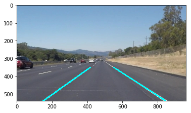

# **Finding Lane Lines on the Road** 

Overview
---
* Outputs: [video 1](https://youtu.be/mnNc1lqebHI), [video 2](https://youtu.be/3iS_FffYM_k)
* [code](Main.ipynb)
* [write up ](writeup_template.md)
