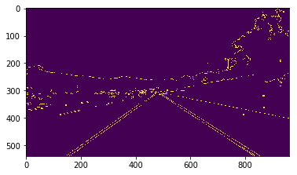
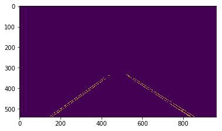
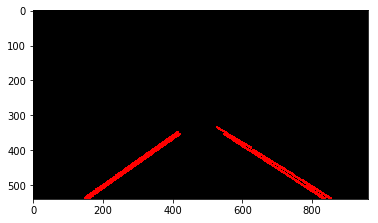

# **Finding Lane Lines on the Road**

---

**Finding Lane Lines on the Road**

The goals / steps of this project are the following:
* Make a pipeline that finds lane lines on the road
* Reflect on your work in a written report

---

### Reflection

### 1. Describe your pipeline. As part of the description, explain how you modified the draw_lines() function.

My pipeline consisted of 5 steps. The functions are defined in [functions.py](functions.py)

> Convert image to Grayscale

> Added gaussian blur

> Canny edge detection

> Masking

> Hough transform

> Fit linear equation

### 2. Identify potential shortcomings with your current pipeline

### 3. Suggest possible improvements to your pipeline

A possible improvement would be to ...

Another potential improvement could be to ...
