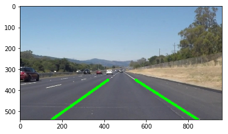

# **Finding Lane Lines on the Road**

---

**Finding Lane Lines on the Road**

The goals / steps of this project are the following:
* Make a pipeline that finds lane lines on the road
* Reflect on your work in a written report

---
### Output

* [Video 1](https://youtu.be/mnNc1lqebHI)
* [Video 2](https://youtu.be/3iS_FffYM_k)
---
### Reflection

### 1. Describe your pipeline. As part of the description, explain how you modified the draw_lines() function.

My pipeline consisted of 5 steps. The functions are defined in [functions.py](functions.py)

> Convert image to Grayscale

> Added gaussian blur (kernel_size = 5)

> Canny edge detection (thresholds = (50, 150))

> Masking

> Hough transform
(rho = 2, theta = pi / 180, threshold = 15,
min_line_length = 40, max_line_gap = 20)

> Fit linear equation

The results are also averaged over 5 frames (trailing) when the pipeline is run for videos.

### 2. Identify potential shortcomings with your current pipeline
Some of the shortcomings of this pipeline are
* We fit a linear equation to the immediate stretch of lane lines ahead of us. This won't approximate well when there are sharp turns
* It doesn't do well with different colored surfaces. For example, it performed quite poorly in the challenge video
* There are a bunch of hand-tuned parameters which may / may not work for other lighting conditions / weather conditions

### 3. Suggest possible improvements to your pipeline

Potential improvements
* Make use of the relationship between the left and right lane (i.e. we expect them to be X feet apart most of the time). Perhaps a Kalman filter (that incorporates this constraint might do better than average smoothing)
* Look at other vehicles in the road to identify lane lines when the markings aren't clear
